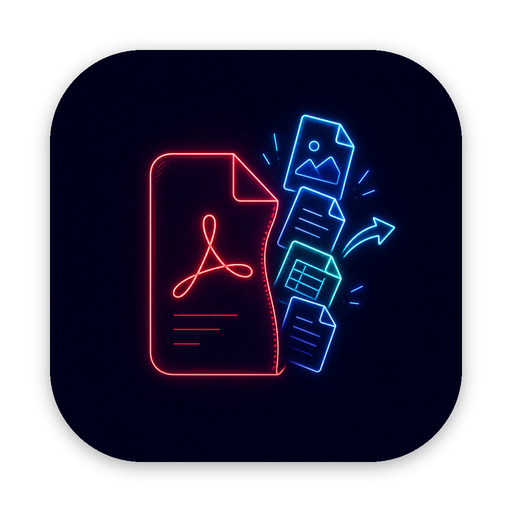
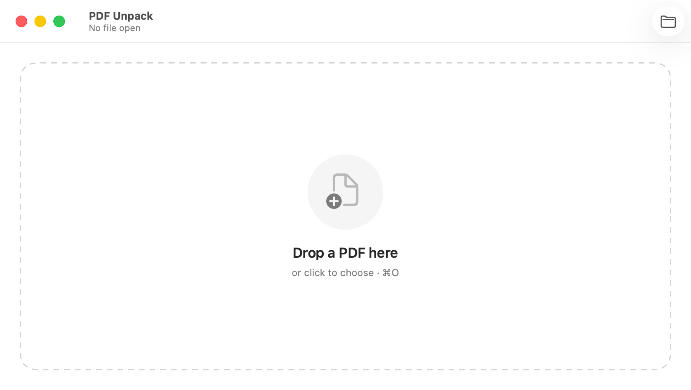
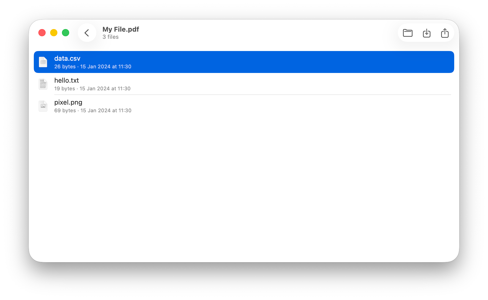

<p align="center">
  
</p>

<h1 align="center">PDF Unpack</h1>

<p align="center">
  Extract the files embedded inside a PDF — portfolios, attachments, and
  password-protected documents. Native macOS, no third-party dependencies.
</p>

<p align="center">
  <a href="https://github.com/lysyi3m/pdf-unpack/actions/workflows/ci.yml">
    
  </a>
</p>

<p align="center">
  
</p>
<p align="center">
  
</p>

## Download

Download the latest `.dmg` from the
[**Releases**](https://github.com/lysyi3m/pdf-unpack/releases/latest) page and
drag **PDF Unpack** into Applications.

> **Note:** the app is not yet notarized. On first launch, approve it under
> **System Settings ▸ Privacy & Security ▸ Open Anyway**.

## Features

- **Open any PDF** — drag-and-drop, click to choose, ⌘O, or Finder's *Open With* / *Services*.
- **Password-protected PDFs** — unlock with the user or owner password.
- **List embedded files** with name, size, and modification date.
- **Quick Look** — press Space (or ⌘Y) for the full macOS preview; ←/→ walk the list.
- **Save** a file, **Save All…** to a folder (never overwrites existing files), or **Share** via the native share sheet.
- **Drag out** any row straight to Finder or the Desktop.

## Requirements

- macOS 15 (Sequoia) or later
- Xcode 16+ (to build)

## Build & run

```bash
brew install xcodegen        # one-time
make generate                # regenerate "PDF Unpack.xcodeproj" from project.yml
open "PDF Unpack.xcodeproj"  # select a signing team, then press ⌘R
```

Common tasks are wrapped in a `Makefile` — run `make` to list them
(`generate`, `test`, `build`, `dmg`, `clean`).

The Xcode project is generated from [`project.yml`](project.yml) — it is
gitignored and must not be hand-edited.

## How it works

PDFKit's `PDFDocument` can unlock and render a PDF but exposes **no** API for
document-level embedded files. Those live in the catalog's
`/Names → /EmbeddedFiles` name tree, reachable only through the lower-level
`CGPDFDocument` C API. That name-tree walk — the one genuinely tricky part — is
isolated in the UI-free, unit-tested `PDFUnpackKit` framework.

## Project structure

| Path | Purpose |
| --- | --- |
| `Sources/Kit/` | `PDFUnpackKit` — UI-free core: CGPDF extractor, PDF date parsing, models, filename hygiene |
| `Sources/App/` | The SwiftUI app (imports `PDFUnpackKit`) |
| `Tests/` | Unit tests (`@testable import PDFUnpackKit`) |
| `fixtures/` | `sample-protected.pdf` — synthetic test fixture (password: `test123`) |

## Testing

The synthetic test fixture (`fixtures/sample-protected.pdf`, password `test123`)
is committed, so the tests run with no setup:

```bash
make test
```

## Scope

v1 handles document-level `/EmbeddedFiles` attachments. Page-level
`/FileAttachment` annotations and PDF 2.0 `/AF` associated files are out of
scope; the app shows a clean empty state when a PDF has no embedded files.

## License

MIT — see [LICENSE](LICENSE).
