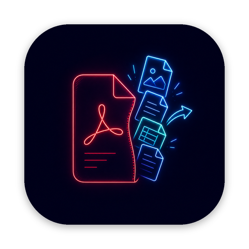
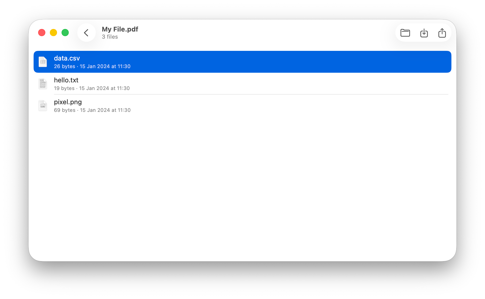

<p align="center">
  
</p>

<h1 align="center">PDF Unpack</h1>

<p align="center">
  Extract the files embedded inside a PDF — portfolios, e-invoices, and
  password-protected documents. Native macOS and iOS, no third-party
  dependencies.
</p>

<p align="center">
  <a href="https://apps.apple.com/app/id6815227329">
    
  </a>
</p>

<p align="center">
  <a href="https://github.com/lysyi3m/pdf-unpack/actions/workflows/ci.yml">
    
  </a>
</p>

<p align="center">
  
</p>

## Features

- **Open any PDF** — drag-and-drop, click to choose, ⌘O, or Finder's *Open With* / *Services* on the Mac; choose one, or share it to PDF Unpack from Files or another app, on iPhone and iPad.
- **Password-protected PDFs** — unlock with the user or owner password.
- **List embedded files** with name, size, and modification date.
- **Quick Look** — press Space (or ⌘Y) on the Mac, or tap a file on iPhone and iPad; move between files from the preview.
- **Save** a file, **Save All…** to a folder (never overwrites existing files), or **Share** via the native share sheet.
- **Drag out** any row straight to Finder or the Desktop (Mac).

## Requirements

- macOS 26 or later, or iOS 26 or later
- Xcode 26 or later and XcodeGen, to build

## Build & run

```bash
brew install xcodegen        # one-time
cp .env.example .env         # one-time; set DEVELOPMENT_TEAM to your Apple Team ID
make generate                # regenerate "PDF Unpack.xcodeproj" from project.yml
open "PDF Unpack.xcodeproj"  # then press ⌘R
```

To try the iOS app, run `make run-ios` (or `make run-ios SIM="iPad Air 11-inch (M4)"`): it builds for
the Simulator, installs the app and launches it. No Team is needed.

Run `make` to list the other tasks (`test`, `build`, `build-ios`, `fixtures`, `clean`).

`PDF Unpack.xcodeproj` is generated from [`project.yml`](project.yml); it is gitignored and must not
be hand-edited. `make generate` projects `DEVELOPMENT_TEAM` from `.env` into
`Config/Local.xcconfig`, so Xcode and `xcodebuild` sign with the same team.

## How it works

PDFKit's `PDFDocument` can unlock and render a PDF but exposes **no** API for
document-level embedded files. Those live in the catalog's
`/Names → /EmbeddedFiles` name tree, reachable only through the lower-level
`CGPDFDocument` C API. That name-tree walk — the one genuinely tricky part — is
isolated in the UI-free, unit-tested `PDFUnpackKit` framework.

## Project structure

| Path | Purpose |
| --- | --- |
| `Sources/Kit/` | `PDFUnpackKit` — UI-free core: CGPDF extractor, PDF date parsing, models, filename hygiene |
| `Sources/App/` | The SwiftUI app (imports `PDFUnpackKit`) |
| `Tests/` | Unit tests (`@testable import PDFUnpackKit`) |
| `Config/` | `Base.xcconfig`; `make generate` writes the rest (git-ignored) |
| `fixtures/` | Synthetic test PDFs — see [`fixtures/README.md`](fixtures/README.md) |
| `tools/` | `make_fixtures.py`, which generates `fixtures/` (build tooling, not shipped) |

## Testing

The synthetic test PDFs in `fixtures/` are committed, so the tests run with no setup:

```bash
make test
```

To regenerate the fixtures, run `make fixtures`. It needs Python 3 and installs a pinned
`pikepdf` into `tools/.venv`.

## Scope

PDF Unpack finds embedded files wherever a PDF keeps them: document-level
`/EmbeddedFiles` (portfolios), page `/FileAttachment` annotations,
and PDF 2.0 associated files (`/AF` — including e-invoices such as
ZUGFeRD / Factur-X and PDF/A-3 archives). A file referenced from more than one
place is listed once. When a PDF has none, it shows a clean empty state.

## Privacy

PDF Unpack collects no data and has no network access — see [PRIVACY.md](PRIVACY.md).

## License

The code is MIT — see [LICENSE](LICENSE). The app's name and icon are reserved; see
[TRADEMARKS.md](TRADEMARKS.md).
